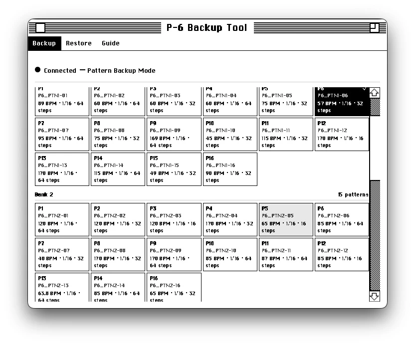
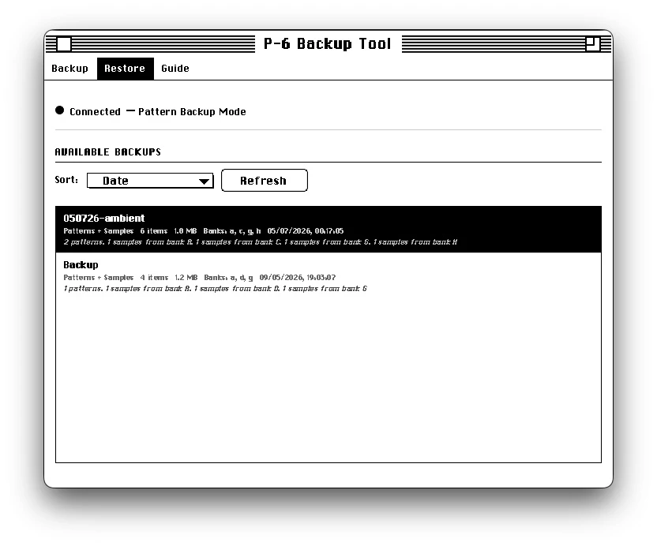
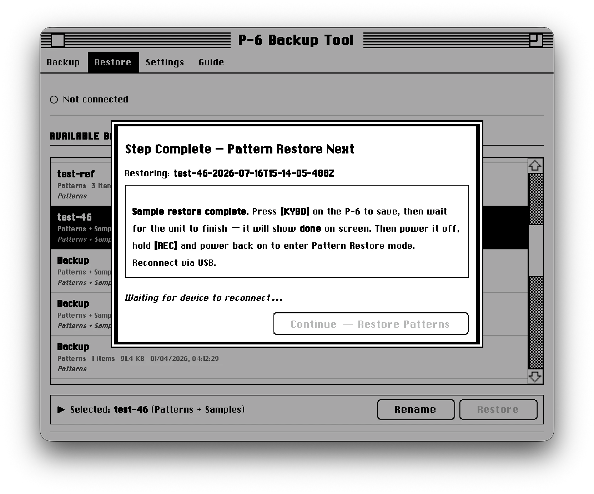

# P6 Backup Tool

Junky, System 6-inspired backup tool for the Roland AIRA P-6 sampler.

## Why this exists

Copying data to and from a P-6 the usual way is a real pain, at least for me. That's why this tool exists: it makes my life—and presumably yours—easier. **Much easier**.

## Get it

Grab the latest build from [Releases](../../releases/latest). There are builds for macOS, Windows, and Linux. Pick your platform, plug in your P-6 and you're ready to go.

## What it does

- Pick the exact patterns you want to copy.
- Read the pattern info and see which sample pads it uses, and from which banks.
- Put several patterns and all of their used samples into one named backup.
- Treat that backup like a project: come back later and restore the whole thing to your P-6.
- Follow the app through the P-6 mode switches while it does the transfers, including the P-6's 10 MB session limit.
- Open the built-in **Guide** tab whenever you need the button-by-button instructions again.

## A look

<table>
  <tr>
    <td align="center"> Pick patterns</td>
    <td align="center"> Choose a backup</td>
    <td align="center"> Follow the steps</td>
  </tr>
</table>

## Install

1. Open [Releases](../../releases/latest) and download the file for your computer.
2. **macOS:** open the `.dmg`, then drag P-6 Backup Tool into Applications.
3. **Windows:** run the `.exe` installer.
4. **Linux:** download the `.AppImage` and allow it to run as a program.

Only download builds from this page.

## macOS says the app cannot be opened

The macOS build is not signed with an Apple developer certificate. If you downloaded it from this project's Releases page, you can allow it once:

1. Try to open **P-6 Backup Tool**, then dismiss the warning.
2. Open **Apple menu → System Settings → Privacy & Security**.
3. Scroll down to **Security** and click **Open Anyway** next to the P-6 Backup Tool message.
4. Click **Open** in the next warning.

You only need to do this once. These are the steps Apple recommends for an app from an identified source that has not been signed or notarized: [Open a Mac app from an unidentified developer](https://support.apple.com/en-us/102445).

## Back up your P-6

1. Connect the P-6 with a USB cable.
2. In the app, open **Backup** and pick the patterns you want to keep.
3. Follow the on-screen steps. The app tells you when to restart the P-6 and which button to hold.
4. Give the backup a name. It stays in the app's backup list until you delete it.

Patterns and the samples they use are backed up together. The app may ask you to reconnect the P-6 while it collects each bank — that is normal.

## Put a backup back

1. Make a fresh backup first. Restoring replaces the selected data on the P-6.
2. Open **Restore**, choose a backup, then choose what to restore.
3. Follow every on-screen step, including the P-6 button prompts.
4. Wait for `donE` on the P-6 before turning it off or unplugging it.

Never turn the P-6 off while a restore is running.

## Button cheat sheet

| What you are doing | Hold while switching the P-6 on |
| --- | --- |
| Back up patterns | **[PLAY]** |
| Restore patterns | **[REC]** |
| Back up samples | **[BANK] + [SAMPLING]** |
| Restore samples | **[SAMPLING]** |

You do not have to memorise this: the app shows the same instructions when it needs a different mode.

## AI disclosure

This project was built with help from AI tools.
Sorry if that makes you mad, disappointed, or something.
It's just my pet project that I built to play around with frontend development.

## Legal

Roland, AIRA, and P-6 are registered trademarks of Roland Corporation. P-6 Backup Tool is an independent project and is not affiliated with, endorsed by, or sponsored by Roland Corporation.
Please don't sue me!

## Credits

The interface uses [System.css](https://github.com/sakofchit/system.css/).

## License

MIT
